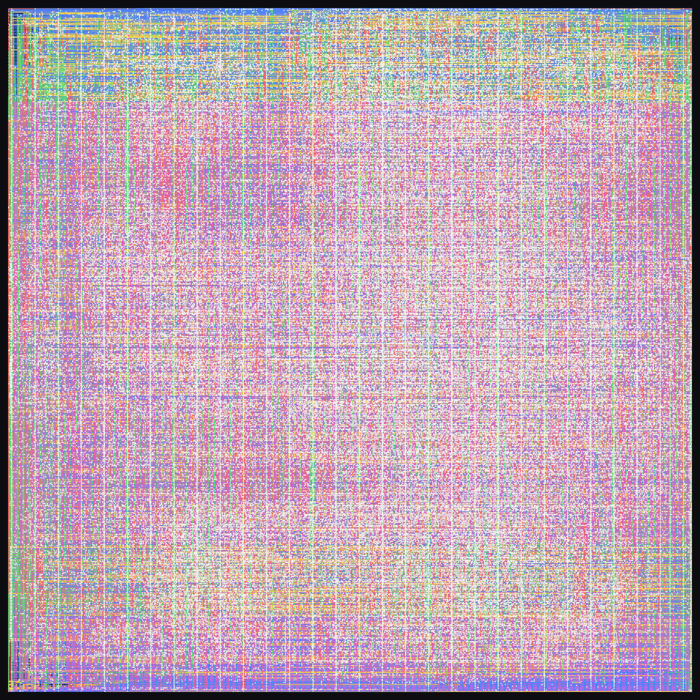
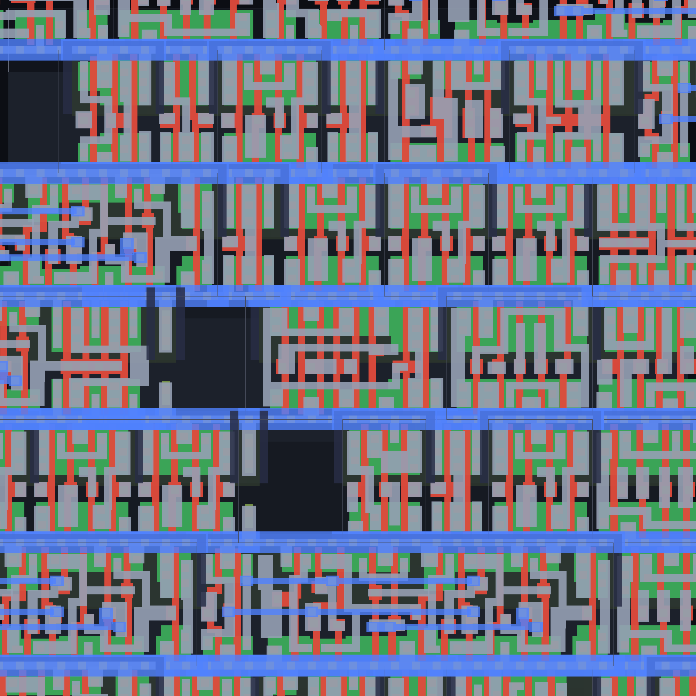

# Riscv_myflow

**RV32IMAC 8-stage pipelined CPU taken from RTL to a signed-off GDSII layout with my own single-binary EDA engine — 79,229 gates on SKY130, formally proven equivalent to the RTL across all 12,946 registers, and timing-closed at 56 MHz after place-and-route.**

This repository contains the complete RTL-to-GDSII flow I actually use — the RTL,
the flow script, the gate-level and post-route netlists, the layout, and the
verification and signoff results. Everything here was produced by my own EDA
engine: a single self-contained program with zero third-party tools underneath
(no OpenROAD, no commercial back-end).

---

## Headline results (RUN 193)

### Logic synthesis
| | |
|---|---:|
| Design | RV32IMAC 8-stage CPU (82 instructions) |
| Target | SKY130 130nm · `sky130_fd_sc_hd` |
| Elaborated gates | 201,072 |
| **Final mapped gates** | **79,229**  (−61%) |
| Registers | 12,946 flip-flops |
| **Formal equivalence** | **PROVEN EQUIVALENT** (complete, all registers / all states) |
| Combinational equivalence (LEC) | 174 / 174 PASS |
| **DFT stuck-at coverage** | **83.0%** (3,134 patterns) |

### Physical design & signoff (place-and-route → GDSII)
| | |
|---|---:|
| **Timing** | **CLOSED at 56 MHz** — post-route STA WNS 0.000 ns / +0.089 ns (CRPR), TT corner; hold clean |
| **LVS (layout ↔ schematic)** | **CLEAN — 78,656 / 78,656 cells matched** |
| **DRC** | **2,003 violations** (m1.2 routing cap dominant; die.1 = 0) |
| Latchup | 99% covered, 408 violations |
| Antenna | 139 violations · ESD 0 |
| Core die | 1,185 × 1,185 µm, 58.5% utilization |
| Routing | 688,889 wires · 247,173 vias · 5 metal layers |
| **GDSII** | **46.5 MB, hierarchical — a fabrication-ready layout** |

The netlist is **not** validated by a handful of test vectors — it is proven, by a
complete sequential equivalence check, to compute identical outputs to the RTL for
**every** possible input sequence. The layout is then verified LVS-clean against
that proven netlist, and its timing is closed at 56 MHz with real post-route
parasitics.

---

## The result, visually

| | |
|---|---|
|  |  |
| **Floorplan** — power rings, stripes, tap array | **Final layout** — placed, clocked, routed |
|  |  |
| **Routing** — 5 metal layers, 688K wires | **Transistor-level zoom** (15 µm window, GDS layers) |

---

## Flow vs. my earlier flow (same core)

The same 8-stage RV32IMAC core hardened by an earlier version of my flow produced
**242,823 mapped cells with no formal proof**. The current flow produces
**79,229 gates (−67%) *and* a complete formal correctness proof *and* a
timing-closed, LVS-clean GDSII**. An intermediate iteration of this flow reached
94,889 gates; the delay-true technology mapper and true-STA-driven sizing in the
current engine bring it down to 79,229. See
[`results/flow_vs_prior.md`](results/flow_vs_prior.md).

---

## Repository layout

```
Riscv_myflow/
├── rtl/
│   └── rv32i_cpu.v               RV32IMAC 8-stage CPU RTL (3,230 lines)
├── flow/
│   ├── synthesis_flow.sf         the synthesis flow script
│   └── pnr_flow_run193.sf        the full RTL→GDSII flow script (RUN 193)
├── netlist/
│   └── rv32i_cpu_synth.v         79,229-gate post-synthesis netlist
├── pnr/
│   ├── output/
│   │   └── rv32i_cpu_pnr.v        post-place-and-route netlist (79,745 gates)
│   ├── gds/
│   │   └── rv32i_cpu_final.gds    final GDSII layout (46.5 MB)
│   └── metrics/
│       └── METRICS_SUMMARY.md     full signoff metrics
├── images/                        layout renders incl. transistor-level zoom
└── results/
    ├── synthesis_report.txt       gate counts, cell composition, DFT
    ├── pnr_report.txt             timing / DRC / LVS / physical signoff
    ├── formal_verification.txt    LEC + complete sequential equivalence proof
    └── flow_vs_prior.md           measured improvement over the earlier flow
```

## What the flow does

The flow runs, in order:

1. **Front-end sign-off** — lint, functional simulation, clock-/reset-domain
   crossing checks, bounded model checking.
2. **Logic synthesis** — RTL is elaborated and optimized into a gate-level
   netlist, then mapped to the SKY130 standard-cell library with a delay-true
   technology mapper. Optimization is correctness-preserving and aggressively
   folds logic into complex library cells.
3. **DFT** — scan/test-pattern generation with adaptive fault-coverage reporting.
4. **Correctness sign-off** — combinational equivalence points, then a
   **complete sequential equivalence proof** covering every register, plus
   clock-gating and property checks.
5. **Physical design** — floorplan, power delivery network, analytical placement,
   pre-placed tap array, clock-tree synthesis (zero-skew), global + detailed
   routing, filler/metal fill.
6. **Signoff** — static timing analysis (with CRPR), multi-corner analysis, DRC,
   LVS, ERC/ESD/latchup/antenna, power; then GDSII stream-out.

The design (RV32IMAC 8-stage: gshare + BTB + RAS branch prediction, iterative
mul/div, full M-mode CSR/PMP, RV32C expansion, RV32A atomics, debug) is a
realistic, verification-heavy core — the results above are on the complete design,
not a toy.

---

*RTL, netlists, layout, and results produced by my own flow. SKY130 is an open PDK.
Timing is closed at the typical (TT) corner; the slow-slow corner is out of scope
for this target. DRC residual is the near-rail metal-1 routing cap plus a small
post-legalization sliver count — both documented in `results/pnr_report.txt`.*
